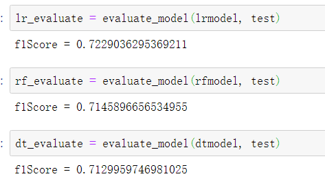
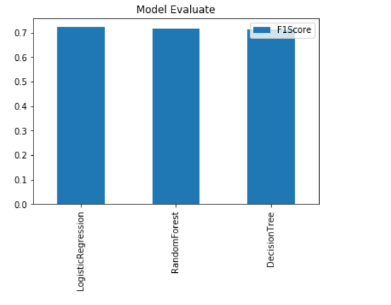

# Project Objective:
This project aims to analyse sparkify user event data and build a model to predict which user has high probability to cancel the service. This can help the company to avoid user cancellation through providing discounts before cancellation.

# Libraries Used:

from pyspark.sql import SparkSession
from pyspark.sql.functions import udf
from pyspark.sql.types import StringType
from pyspark.sql.types import IntegerType
from pyspark.sql.functions import desc
from pyspark.sql.functions import asc
from pyspark.sql.functions import sum as Fsum
from pyspark.sql.functions import isnan, when, count, col
from pyspark.sql import Window
from pyspark.ml.classification import LogisticRegression
from pyspark.ml.classification import RandomForestClassifier
from pyspark.ml.feature import VectorAssembler
from pyspark.ml import Pipeline
from pyspark.ml.feature import StandardScaler
from pyspark.ml.classification import DecisionTreeClassifier
from pyspark.ml.evaluation import MulticlassClassificationEvaluator
import numpy as np
import pandas as pd
import matplotlib.pyplot as plt

# Files in the repository:

- Mini_sparkify_event_data.json
   A subset of sparkify_event_data which record user information and activities
- Sparkify.ipynb
   This file explore, analysis the sparkify_event_data and build a user cancellation prediction model
  

# Results Summary and analysis:

By comparing the F1 score and accuracy, I found logistic regression algorithm had the best performance.

# Medium post： https://czeng98.medium.com/sparkify-subscription-cancellation-analysis-d3b9a2a5c8f5